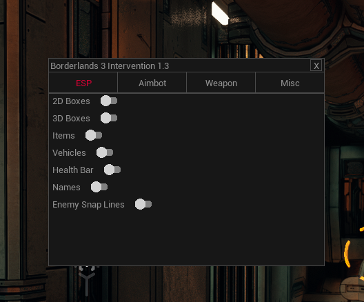
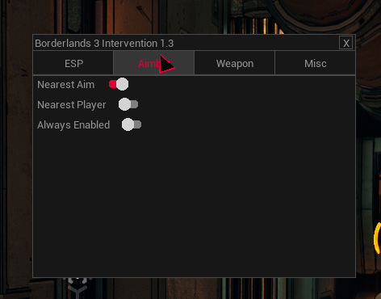
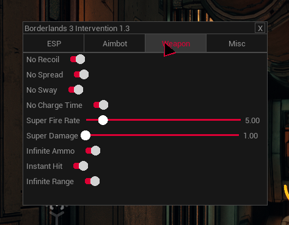
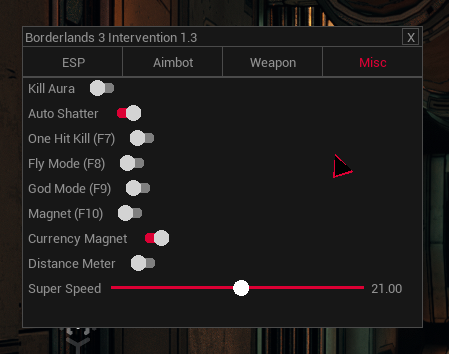
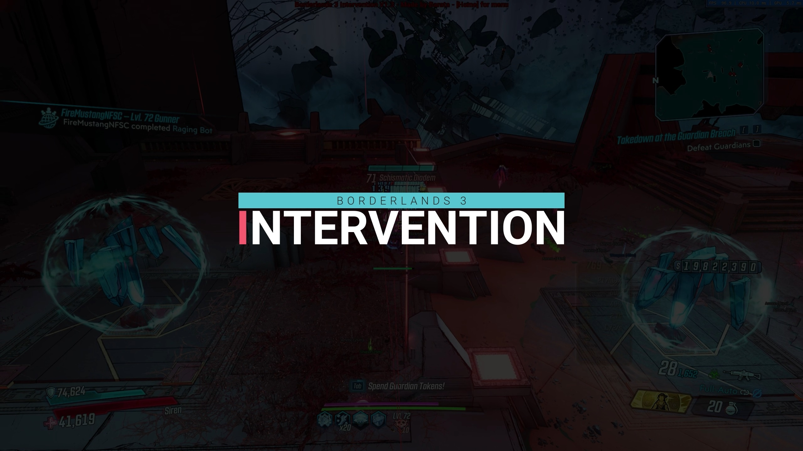

# borderlands3-intervention
Project to learn more about Unreal Engine 4.20.3 by hacking Borderlands 3

PLEASE REMENBER THIS IS FAR FROM PERFECT AND NEVER WILL BE!

The following is included:

- Aimbot
  - Nearest Aim
  - Nearest Enemy
  
- ESP
  - 2D Boxes
  - 3D Boxes
  - Draw Items
  - Draw Vehicles ESP
  - Draw Health Bars
  - Draw Names
  - Draw Snap Lines
  
- Weapon
  - Remove Recoil
  - Remove Spread
  - Remove Sway
  - Remove Charge Time
  - Super Fire (Increase fire speed)
  - Super Damage (Increase damage)
  - Infinite Ammo
  - Instant Hit (bullets hit the target as soon as you fire)
  - Infinite Range (really high range for bullets/shots)
  
- MISC
  - Super Speed (Increased movement speed)
  - Kill Aura (Kills enemies instantly)
  - Auto Shatter (Auto shatters frozen enemies)
  - One Hit Kill (Sets enemie's health to 1)
  - Fly Mode (Noclip)
  - God Mode
  - Magnet (Teleports enemies to your aim)
  - Currency Magnet (Teleports currency to you)

## Screenshots

### Menu

### ESP

## Video

